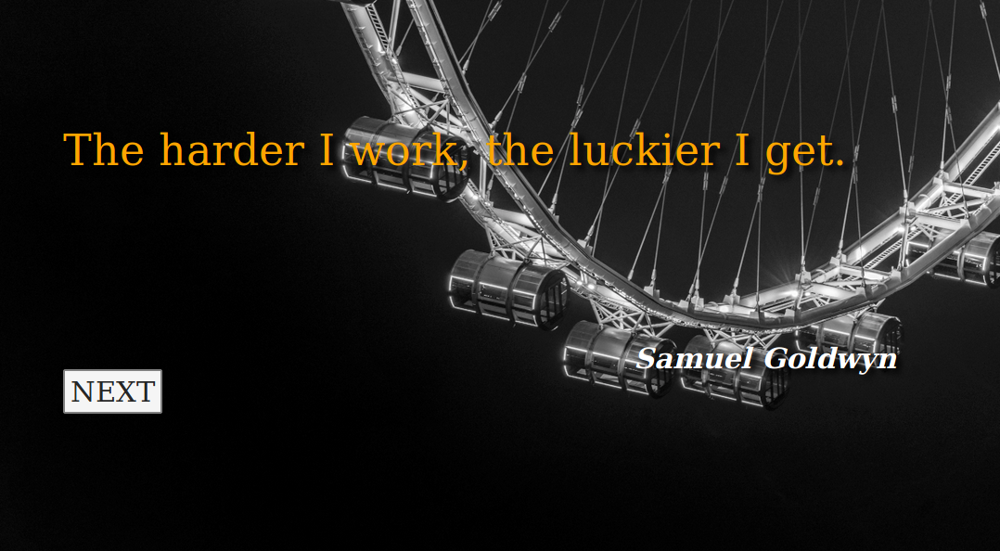

# citation
--------------


## Critères qualité
* Vue JS only => Zéro manipulation native DOM !!!
* Framework CSS : Au choix (Bulma)
* Les citations sont écrites en dur 
* Un bouton « Nouvelle Citation » qui en génère aléatoirement 1
* Vue-Cli obligatoire 
* La génération de citation, modifie le CSS 
* Possibilité de jouer avec des images d’illustrations 
* Minimum 5 citations, plus il y en a, mieux c’est ... 
* La citation doit contenir une citation et un auteur 
* Mise en avant de la citation 
* L’auteur en bas à droite avec un police plus discrète

## Project setup
```
npm install
```

### Compiles and hot-reloads for development
```
npm run serve
```

### Compiles and minifies for production
```
npm run build
```

### Run your tests
```
npm run test
```

### Lints and fixes files
```
npm run lint
```

### Customize configuration
See [Configuration Reference](https://cli.vuejs.org/config/).
